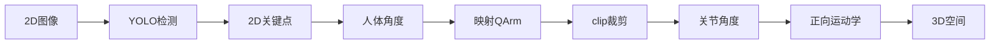

# 角度映射说明文档

## 目录
1. [坐标系定义](#坐标系定义)
2. [角度计算流程](#角度计算流程)
3. [2D 角度计算的局限性](#2d-角度计算的局限性)
4. [角度映射公式](#角度映射公式)
5. [关节限制处理](#关节限制处理)
6. [运行模式](#运行模式)

---

## 坐标系定义

### 物理坐标系（统一标准）
```
        Z ↑ (蓝色，向上)
          |
          |
          |_____→ X (红色，向右)
         /
        /
       ↓
    Y (绿色，向前/远离相机)
```

| 轴 | 颜色 | 方向 | 正方向 |
|----|------|------|--------|
| **X** | 🔴 红色 | 水平 | → 向右 |
| **Y** | 🟢 绿色 | 前后 | ↓ 向前（远离相机） |
| **Z** | 🔵 蓝色 | 垂直 | ↑ 向上（反重力） |

### 相机图像坐标系（2D）
| 轴 | 方向 | 正方向 |
|----|------|--------|
| **X** | 水平 | → 向右 |
| **Y** | 垂直 | ↓ 向下（图像坐标系标准） |

---

## 角度计算流程

### 流程图




### 详细步骤

| 步骤 | 输入 | 处理函数 | 输出 |
|------|------|----------|------|
| **1** | 相机图像 (640×480) | YOLOv8-pose | 2D 关键点 (x, y) |
| **2** | 关键点坐标 | `calculate_joint_angles()` | 人体关节角度 |
| **3** | 人体角度 | `map_arm_to_qarm()` | QArm 关节角度 |
| **4** | 关节角度 | `forward_kinematics()` | 3D 空间位置 |

---

### 2D 关键点输出格式

| 关键点 | YOLO 索引 | 输出格式 | 示例 |
|--------|-----------|----------|------|
| 右肩 | 6 | (x, y) 归一化坐标 | (0.5, 0.4) |
| 右肘 | 8 | (x, y) 归一化坐标 | (0.5, 0.6) |
| 右腕 | 10 | (x, y) 归一化坐标 | (0.5, 0.7) |

**注意：** 输出为 2D 坐标，**无深度信息（z）**

---

## 2D 角度计算的局限性

### 问题：没有深度信息的影响

由于 YOLOv8-pose 只输出 2D 图像坐标，丢失了深度（z）信息，导致以下问题：

#### 1. 透视投影误差

```
3D 空间中的同一角度，在不同深度下投影到 2D 图像的角度不同

示例：肘部弯曲 90°

近距离 (z=0.5m):     远距离 (z=1.5m):
    肘─腕              肘─────腕
    │                  │
    │                  │
    肩                  肩

2D 投影角度: ~60°    2D 投影角度: ~85°
(被压缩)             (接近真实)
```

#### 2. 肘关节 J3 识别不准确场景

| 场景 | 3D 实际角度 | 2D 识别角度 | 误差原因 |
|------|------------|-------------|----------|
| 手臂**远离**相机 | 弯曲90° | 识别为更小的角度 | 透视压缩 |
| 手臂**靠近**相机 | 弯曲90° | 识别为更大的角度 | 透视放大 |
| 手臂**左右移动** | 弯曲90° | 基本准确 | 在同一深度平面 |
| 手臂**垂直移动** | 弯曲90° | 误差较小 | 深度变化小 |

#### 3. 当前代码的处理方式

```python
# 当前代码：直接使用 2D 投影角度计算
def calculate_angle(a, b, c):
    # a, b, c 都是 2D 坐标 (x, y)
    # 没有深度补偿
    angle = calculate_2D_angle(a, b, c)
    return angle  # 可能存在误差
```

**局限性：**
- 无法区分"手臂远离相机弯曲"和"手臂靠近相机弯曲"
- 深度变化大的情况下，肘部角度识别误差可达 ±20°

### 改进方案（可选）

| 方案 | 优点 | 缺点 | 实现难度 |
|------|------|------|----------|
| **双目相机** | 获取真实深度 | 硬件成本增加 | 中 |
| **深度估计模型** | 单相机即可 | 需要额外模型 | 中 |
| **卡尔曼滤波** | 平滑预测 | 有延迟 | 低 |
| **当前方案** | 简单快速 | 有误差 | - |

**当前项目采用：** 直接使用 2D 角度，接受一定的误差

---

## 角度映射公式

### Joint 1: 底座旋转

| 项目 | 值 |
|------|-----|
| **人体输入** | 手臂水平方向（肩→肘向量） |
| **计算公式** | `joint1 = atan2(dx, -dy) × 2` |
| **硬件限制** | -170° ~ 170° |
| **零位** | 正前方 |

```python
# 计算手臂向量（从肩膀指向肘部）
arm_vector = elbow_pos - shoulder_pos
dx = arm_vector[0]  # x差值（图像坐标）
dy = arm_vector[1]  # y差值（图像坐标）

# 计算水平角度: 以正前方为0°, 左转为负, 右转为正
horizontal_angle = degrees(atan2(dx, -dy))

# 映射到 -170 到 170° 范围
joint1 = clip(horizontal_angle * 2, -170, 170)
```

---

### Joint 2: 肩部 Pitch

| 项目 | 人体 | QArm |
|------|------|------|
| **0°** | 下垂 | -90° |
| **90°** | 水平 | 0° |
| **180°** | 上举 | 85° |

**映射公式：**
```python
# 线性映射: [0, 180] -> [-90, 85]
joint2 = shoulder_angle × (175/180) - 90
joint2 = clip(joint2, -85, 85)
```

**示例：**
| 人体肩部角度 | 计算值 | 裁剪后 | 说明 |
|-------------|--------|--------|------|
| 0° (下垂) | -90° | -90° | |
| 45° (斜下) | -56.25° | -56.25° | |
| 90° (水平) | -2.5° | -2.5° ≈ 0° | 接近水平 |
| 135° (斜上) | 51.25° | 51.25° | |
| 180° (上举) | 105° | 85° | 裁剪到上限 |

---

### Joint 3: 肘部弯曲

| 项目 | 人体 | QArm |
|------|------|------|
| **180°** | 伸直 | 0° |
| **90°** | 向前弯90° | 90° |
| **270°** | 向后弯90° | -90° |

**映射公式：**
```python
if elbow_angle <= 180:
    # 向前弯曲 (0-90°)
    joint3 = clip(180 - elbow_angle, 0, 90)
else:
    # 向后弯曲 (0 到 -95°)
    joint3 = clip(180 - elbow_angle, -95, 0)
```

**示例：**
| 人体肘部角度 | QArm J3 | 说明 |
|-------------|---------|------|
| 180° | 0° | 完全伸直 |
| 150° | 30° | 轻微向前弯曲 |
| 90° | 90° | 向前弯曲90° |
| 270° | -90° | 向后弯曲90° |
| 300° | -120° → -95° | 裁剪到下限 |

---

### Joint 4: 腕部旋转

| 项目 | 值 |
|------|-----|
| **人体输入** | 上臂→前臂的角度差 |
| **计算公式** | `joint4 = angle_fore - angle_upper` |
| **硬件限制** | -160° ~ 160° |

```python
# 计算上臂向量角度
angle_upper = atan2(upper_arm_vector[1], upper_arm_vector[0])
# 计算前臂向量角度
angle_fore = atan2(forearm_vector[1], forearm_vector[0])
# 角度差
joint4 = clip((angle_fore - angle_upper) × 180/π, -160, 160)
```

---

## 关节限制处理

### 硬件限制（QArm 实际参数）

| 关节 | 最小角度 | 最大角度 | 说明 |
|------|----------|----------|------|
| **Joint 1** | -170° | 170° | 底座旋转 |
| **Joint 2** | -85° | 85° | 肩部 Pitch |
| **Joint 3** | -95° | 75° | 肘部弯曲 |
| **Joint 4** | -160° | 160° | 腕部旋转 |

### 超限处理方式

**在映射函数中自动裁剪：**
```python
joint2 = clip(..., -85, 85)   # 自动限制在硬件范围
joint3 = clip(..., -95, 75)   # 自动限制在硬件范围
joint1 = clip(..., -170, 170) # 自动限制在硬件范围
joint4 = clip(..., -160, 160) # 自动限制在硬件范围
```

**处理流程：**
```
人体角度 → 映射公式 → np.clip(范围) → 最终关节角度
          ↑           ↑
       线性转换    强制裁剪到硬件限制
```

---

## 运行模式

### 模式对比

| 模式 | physics_enabled | 关节范围 | 说明 |
|------|-----------------|----------|------|
| **硬件限制模式** | True | 硬件实际限制 | 仿真真实机械臂 |
| **自由模式** | False | ±180° | 无限制演示 |

### 模式切换

**键盘控制：**
- 按 `p` 键切换模式

**代码中设置：**
```python
sim.physics_enabled = True   # 硬件限制模式
sim.physics_enabled = False  # 自由模式
```

### 各模式下的行为

| 场景 | 硬件限制模式 | 自由模式 |
|------|-------------|----------|
| **手势控制** | 自动裁剪到硬件范围 | 允许超限运动 |
| **滑块控制** | 滑块范围=硬件限制 | 滑块范围=±180° |
| **IK 求解** | 考虑硬件限制 | 不考虑限制 |
| **显示状态** | "P:ON (Hardware)" | "P:OFF (Free ±180°)" |

---

## 总结

### 关键点

1. **不是坐标变换，而是角度映射**
   - 相机 2D 图像 → 人体关节角度 → QArm 关节角度

2. **映射时自动裁剪**
   - 在 `map_arm_to_qarm()` 函数中，每个关节都使用 `np.clip()` 限制在硬件范围内

3. **两种运行模式**
   - 硬件限制模式：真实仿真
   - 自由模式：无限制演示

4. **统一物理坐标系**
   - 相机显示、3D 视图都使用相同的物理坐标系定义

5. **⚠️ 2D 角度计算的局限性**
   - YOLOv8-pose 只输出 2D 坐标，**无深度信息**
   - 肘关节 J3 在深度变化大时可能识别不准确（误差 ±20°）
   - 手臂远离相机：角度被压缩（识别值 < 实际值）
   - 手臂靠近相机：角度被放大（识别值 > 实际值）

### 已知误差场景

| 场景 | 影响程度 | 建议 |
|------|----------|------|
| 手臂在固定深度平面移动 | ✅ 影响小 | 可正常使用 |
| 手臂前后大幅度移动 | ⚠️ 误差大 | 保持手臂在相对固定深度 |
| 手臂靠近相机 | ⚠️ 误差大 | 保持适当距离（0.5-1.5m） |

### 代码文件位置

- 角度计算: `src/utils.py` - `calculate_joint_angles()`, `map_arm_to_qarm()`
- 仿真器: `src/qarm_sim.py` - `QarmSimulator` 类
- 主程序: `src/main.py` - `HandControlQarmDemo` 类
- 姿态检测: `src/hand_tracker.py` - `PoseTracker` 类
