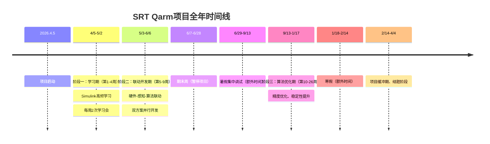
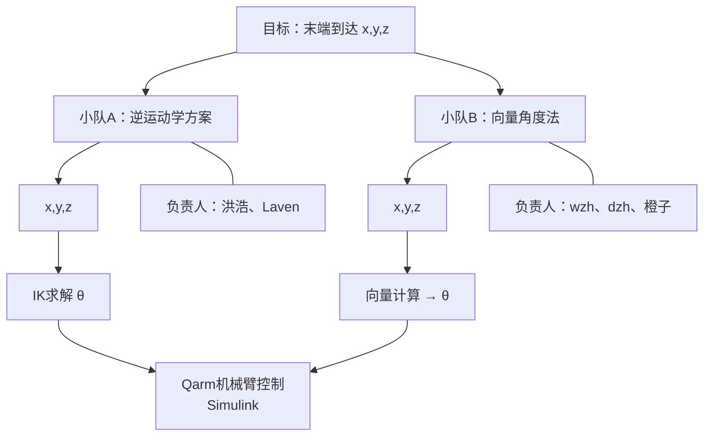
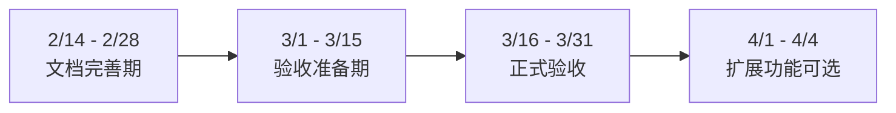

# SRT Qarm机械臂项目 - 全年进度表

> **项目名称**: SRT Qarm机械臂示教系统
> **负责老师**: 郭九明
> **项目周期**: 2026.4.5 - 2027.4.4
> **创建日期**: 2026.4.5

---

## 目录

1. [时间线总览](#时间线总览)
2. [团队分工](#团队分工)
3. [阶段一：前期 - 学习期（第1-4周）](#阶段一前期---学习期第1-4周)
4. [阶段二：中期 - 联动开发期（第5-9周）](#阶段二中期---联动开发期第5-9周)
5. [期末周安排](#期末周安排)
6. [暑假集中调试](#暑假集中调试)
7. [阶段三：后期 - 算法优化期（第10-26周）](#阶段三后期---算法优化期第10-26周)
8. [寒假安排](#寒假安排)
9. [项目缓冲期 - 结题阶段](#项目缓冲期---结题阶段)
10. [周常安排提醒](#周常安排提醒)
11. [最终交付内容](#最终交付内容)
12. [附录](#附录)

---

## 时间线总览



### 项目周期统计

| 阶段 | 周数 | 时间范围 | 计入周期 | 备注 |
|:----:|:----:|:---------|:--------:|:-----|
| 前期-学习期 | 4周 | 4/5 - 5/2 | ✅ | 每周2次学习会 |
| 中期-联动开发 | 5周 | 5/3 - 6/6 | ✅ | 双方案并行 |
| 期末周 | ~3周 | 6/7 - 6/28 | ❌ | 考试周，暂停 |
| 暑假调试 | ~11周 | 6/29 - 9/13 | ❌ | 额外时间 |
| 后期-算法优化 | 17周 | 9/13 - 1/17 | ✅ | 精度优化 |
| 寒假准备 | ~4周 | 1/18 - 2/14 | ❌ | 结题准备 |
| 项目缓冲期 | ~7周 | 2/14 - 4/4 | ✅ | 验收/扩展 |
| **总计** | **26周** | **4/5 - 4/4** | | 实际项目周期 |

---

## 团队分工

| 成员 | 角色 | 技术方向 |
|:----:|:----:|:---------|
| **洪浩** | 组长 | Matlab/Simulink、整体协调 |
| **wzh** | 组员 | 深度相机 |
| **dzh** | 组员 | Python + YOLO |
| **橙子** | 组员 | Python(Quanser SDK) |
| **Laven** | 组员 | D-H坐标系和算法 |

### 小队分组（中期并行开发）

| 小队 | 成员 | 技术路线 |
|:----:|:----:|:---------|
| **小队A** | 洪浩、Laven | 逆运动学方案 |
| **小队B** | wzh、dzh、橙子 | 向量角度法 |

---

## 阶段一：前期 - 学习期（第1-4周）

**时间**: 2026.4.5(日) - 2026.5.2(六)，共4周

**目标**: 高频次学习Simulink，掌握基础知识

### 周常安排

| 时间 | 时段 | 地点 |
|:----:|:----:|:----:|
| 每周二 | 16:00-17:00 | A311 |
| 每周日 | 14:00-16:00 | A311 |

### 每周安排

| 周次 | 日期 | 主题 | 学习内容 |
|:----:|:-----|:-----|:---------|
| 第1周 | 4/5 - 4/11 | Simulink基础入门 | 环境搭建、界面熟悉、基本模块 |
| 第2周 | 4/12 - 4/18 | 建模与仿真 | 控制系统建模、PID控制器 |
| 第3周 | 4/19 - 4/25 | Qarm硬件接口 | Qarm硬件、HIL仿真 |
| 第4周 | 4/26 - 5/2 | Python-Simulink连接 | MATLAB Engine API、通信调试 |

---

## 阶段二：中期 - 联动开发期（第5-9周）

**时间**: 2026.5.3(日) - 2026.6.6(六)，共5周

**目标**: 购买配件，实现硬件-感知-算法联动（不强调精度）

### 双方案并行开发



### 每周安排

| 周次 | 日期 | 小队A任务 | 小队B任务 | 全员任务 |
|:----:|:-----|:----------|:----------|:----------|
| 第5周 | 5/3 - 5/9 | 逆运动学算法框架 | 深度相机SDK学习 | 购买配件 |
| 第6周 | 5/10 - 5/16 | 坐标系转换矩阵 | YOLOv8-pose环境 | 硬件连接 |
| 第7周 | 5/17 - 5/23 | Matlab-Simulink模型 | Quanser SDK封装 | 软硬件联调 |
| 第8周 | 5/24 - 5/30 | A方案完整链路测试 | B方案完整链路测试 | 双方案对比 |
| 第9周 | 5/31 - 6/6 | 双方案融合/选择 | 双方案融合/选择 | **中期验收** |

### 中期任务清单

| 优先级 | 任务 | 负责人 |
|:------:|:-----|:------:|
| P0 | 购买配件（USB 3.0线×5等） | 洪浩 |
| P0 | 硬件连接与调试 | 全员 |
| P0 | 深度相机数据采集 | wzh |
| P0 | YOLO手部检测 | dzh |
| P0 | 逆运动学算法 | Laven |
| P0 | Python-Simulink接口 | 橙子 |

---

## 期末周安排

**时间**: 2026.6.7(日) - 2026.6.28(日)


**状态**: ⚠️ **暂停项目任务**

---

## 暑假集中调试

**时间**: 2026.6.29(一) - 2026.9.13(日)，约11周

**性质**: ⏱️ 额外时间，不计入项目周期

**说明**: 洪浩可能不在北京，具体安排期末后确定

---

## 阶段三：后期 - 算法优化期（第10-26周）

**时间**: 2026.9/13(日) - 2027.1/17(日)，约17周

**目标**: 算法优化，达到预期效果

### 分阶段安排

| 周次 | 日期 | 主题 |
|:----:|:-----|:-----|
| 第10-14周 | 9/13 - 10/11 | 算法精度提升 |
| 第15-18周 | 10/12 - 11/9 | 跟随效果优化 |
| 第19-22周 | 11/10 - 12/7 | 稳定性提升 |
| 第23-26周 | 12/8 - 1/17 | 综合优化与验收准备 |

---

## 寒假安排

**时间**: 2027.1/17(日) - 2027.2/14(日)

**性质**: 📝 额外时间，不计入项目周期

**任务**: 文档整理、验收准备

| 任务 | 产出物 |
|:-----|:------:|
| 项目报告撰写 | 项目报告初稿 |
| 用户手册编写 | 用户手册 |
| 演示视频制作 | 演示视频 |

---

## 项目缓冲期 - 结题阶段

**时间**: 2027.2/14(日) - 2027.4/4(日)



### 主要任务

### 可能的扩展功能

- 多手势识别（抓取、放置等）
- 物体识别与抓取
- 轨迹记录与回放
- 远程控制功能

---

## 周常安排提醒

### 固定学习会

| 时间 | 时段 | 地点 | 内容 |
|:----:|:----:|:----:|:-----|
| 每周二 | 16:00-17:00 | A311 | Simulink学习 |

### 每周日例会

| 时间 | 时段 | 内容 |
|:----:|:----:|:-----|
| 每周日 | 待定 | 进度同步（非Simulink学习） |

---

## 最终交付内容

### 至少完成

- 右手单臂的识别（末端姿态——逆运动学 // 重叠度误差最小的）

方法1：洪浩（长方体覆盖面积小——计算量大）


方法2：橙子（向量法——计算量小——体现效果？）


Laven：曲臂 // 伸长（动态拟合，在实现过程中判定是否沿用其中一个逼近的方法）
末端一致/角度一致/
因为阉割了自由度，对应也会在机械臂阉割了一些精度：让这个模拟，达到效果最大化

影响因子：长度比例区别，自由度阉割角度（BenchMark）
- 末端位置最近？
- 面积覆盖率最高？
（AI/知网论文——相似作品）


### 超额完成

- 双臂
- 显示屏
- 夹具：握住空瓶子，拿起来，丢进一个容器里边


- 倒水
---

## 附录

### A. 项目文档体系

```
项目根目录/
├── 会议记录_项目管理/
│   ├── 26周进度表.MD
│   └── [按日期的会议记录文件夹]
├── 财政与配件/
├── 参考文档/
├── 开发文档（论文）/
└── ...
```

---

## 变更记录

| 日期 | 版本 | 变更内容 |
|:----:|:----:|:---------|
| 2026/4/5 | v1.0 | 初始版本创建 |
