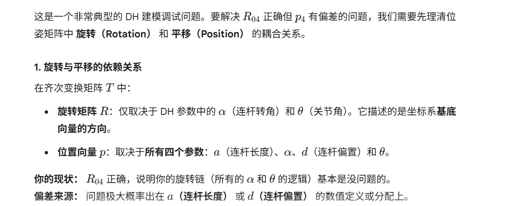
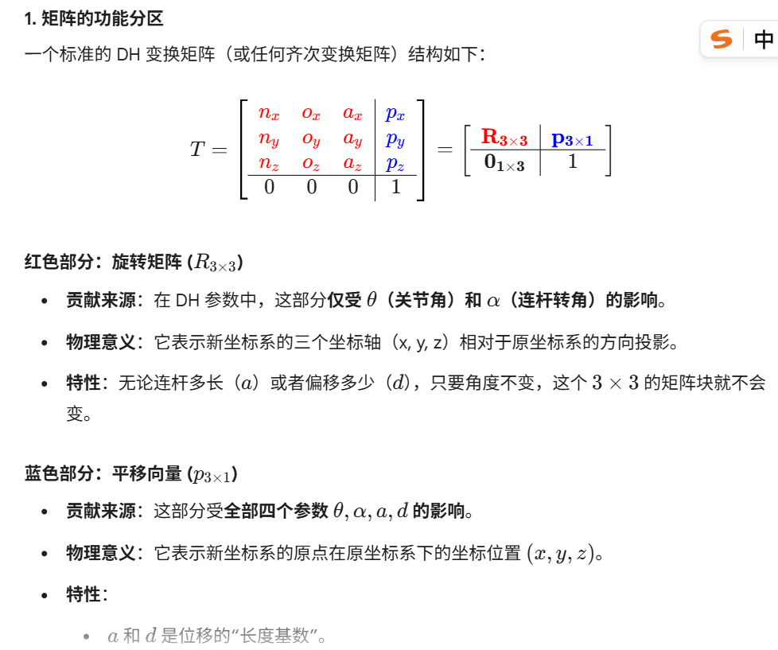
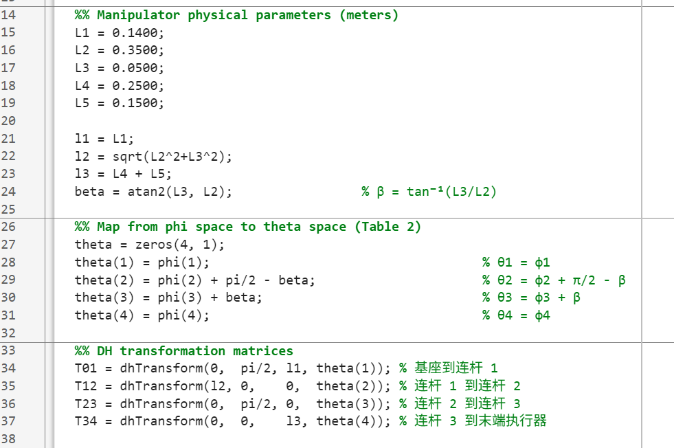
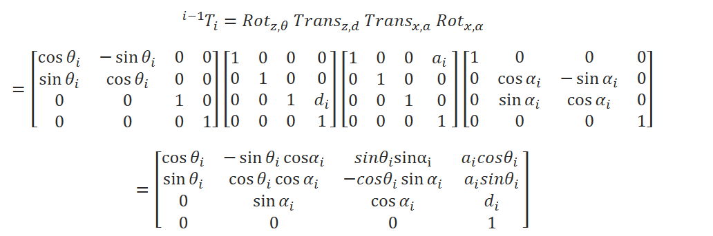
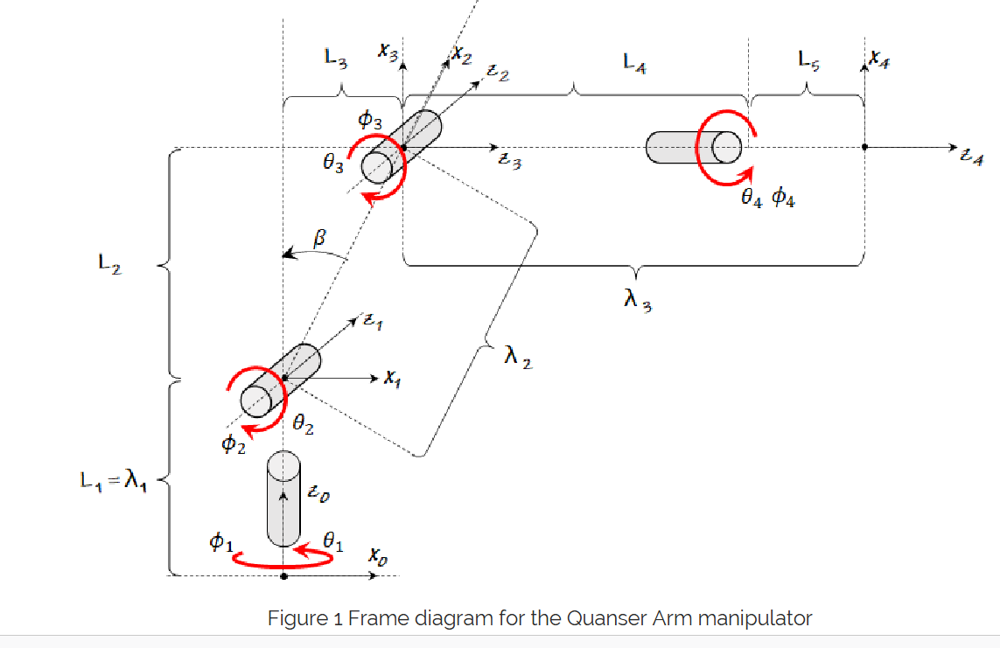
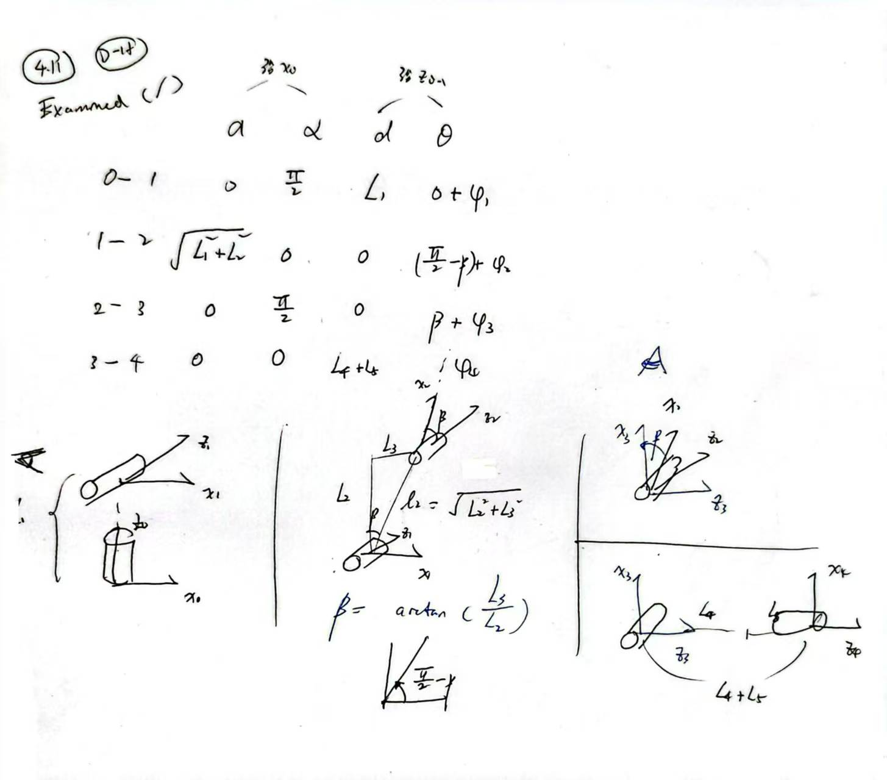

# 正运动学

p：平移矩阵；R：旋转矩阵

## 矩阵分区（平移、旋转）

## 洪浩的笔记

每个机器人自己都有各种坐标系的定义方式（笛卡尔，D-H）

D-H又可以分标准，和改进，但这一切都不重要，只要对齐我们在用的机械臂用的"标准"

在这里，先声明（原先上传上去的D-H和QArm本身的定义不对齐）

## 正确的D-H参数（跑通LAB 02）

注意：l1,l2,l3,beta,theta(phi+Const)，明确下φ：RRRR关节的自由度，是变量，其余的都是固定的常量

首先理解下图：0,1,2,3,4（一共5个状态，4个转变）

## 四个矩阵的连续变化

我们要理清一个事情是：

下述这个四个矩阵的连续变化（右到左）旋转α，平移a，平移d，旋转θ（这里暂时不标准是谁沿着谁，见文末）

QArm手册里定义的转变：

（白话解释D-H参数表）

0-1：z方向平移L1，z0沿着x1"逆时旋转"得到+pi/2，关节角度θ：0+φ

1-2：以此类推，参考手写辅助笔记：

## QArm D-H定义（谁沿着谁）

