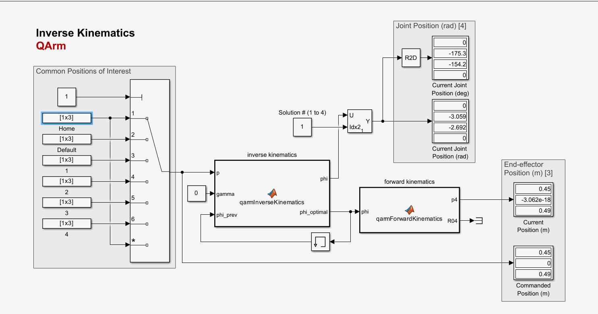
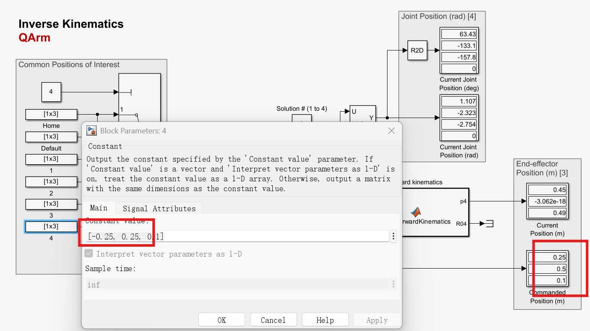

# 逆运动学

## 洪浩说明

具体推导我不太关心，我只知道QARm手册里给得足够详尽，大模型帮我把代码直接从QArm手册识别出来填上，就能运行成功了

## 判定方法

给定末端姿态，如：位置1——（0.45,0,0.49）先经过一轮IK得到右上角的"满足关节角度条件"里4组解的"连续位移最短路径"的解，经过FK再进行验算，会得到和位置1，一样的坐标，那就代表，FK，IK这两个互为逆运算的函数正确

## 验算正确，位置1

Current & End Effector几乎一样，因为起点就是位置1，在"物理空间坐标系"底下是0.45,0.000000,0.49

## 验证正确，位置4

Current是原本的，只需要观察End Effector正确与否，此时在有硬件下运行即可让机械臂从Current-End运动

